### Introduction

Historic information of Crimes in a city can be used to prevent crimes similar nature in future. Many city bodies are already doing this. In this data analysis project, I  will explore the City of Vancouver's crime data(2003 - 2017) and see if we can see any trends in crime occurrences which in turn can help in predicting future crimes.


### Dataset
Crime data is made public by City of Vancouver on their website. The dataset used here has following attributes

* TYPE: The type of crime activities
* YEAR: year
* MONTH: Month of the year
* DAY: Day of the month
* HOUR: Hour in 24 hour format for reported crime
* MINUTE: Minute of the hour for reported crime
* HUNDRED_BLOCK: Generalized location of the report crime activity
* NEIGHBOURHOOD: The Vancouver Police Department uses the Statistics Canada definition
* X: Coordinate values are projected in UTM Zone 10. 
* Y: Coordinate values are projected in UTM Zone 10.

More deails about the data set can be found at open data catalog of the City of Vancouver https://data.vancouver.ca/datacatalogue/crime-data.htm


### Loading dataset and libraries 


The downloaded csv data from City's catalog and other libraries used are loaded


```r
##loading data

crime_data <- read.csv("crime_csv_all_years.csv", header = TRUE)

##loading  reqlibraries
 ## for projecting long and latitude values on map
library(dplyr)
```

```
## 
## Attaching package: 'dplyr'
```

```
## The following objects are masked from 'package:stats':
## 
##     filter, lag
```

```
## The following objects are masked from 'package:base':
## 
##     intersect, setdiff, setequal, union
```

```r
library(lubridate) ## for timestamp info
```

```
## 
## Attaching package: 'lubridate'
```

```
## The following object is masked from 'package:base':
## 
##     date
```

```r
library(ggplot2)
library(repr)
library(rgdal)
```

```
## Loading required package: sp
```

```
## rgdal: version: 1.3-6, (SVN revision 773)
##  Geospatial Data Abstraction Library extensions to R successfully loaded
##  Loaded GDAL runtime: GDAL 2.2.3, released 2017/11/20
##  Path to GDAL shared files: C:/Users/I853328/Documents/R/win-library/3.5/rgdal/gdal
##  GDAL binary built with GEOS: TRUE 
##  Loaded PROJ.4 runtime: Rel. 4.9.3, 15 August 2016, [PJ_VERSION: 493]
##  Path to PROJ.4 shared files: C:/Users/I853328/Documents/R/win-library/3.5/rgdal/proj
##  Linking to sp version: 1.3-1
```

```r
library(proj4)
```

```
## 
## Attaching package: 'proj4'
```

```
## The following object is masked from 'package:rgdal':
## 
##     project
```

```r
library(mapview)
```


Basic summary functions on dataset


```r
head(crime_data)
```

```
##                                TYPE YEAR MONTH DAY HOUR MINUTE
## 1                Theft from Vehicle 2003     3  25    8      0
## 2                Theft from Vehicle 2003     9  12   16      0
## 3                Theft from Vehicle 2003     6   8   20      0
## 4                Theft from Vehicle 2003     4   9    8      0
## 5 Break and Enter Residential/Other 2003     7  29   10      0
## 6                Theft from Vehicle 2003     5  14    1      0
##       HUNDRED_BLOCK             NEIGHBOURHOOD        X       Y
## 1     6XX ROBSON ST Central Business District 491356.6 5458679
## 2  11XX PENDRELL ST                  West End 490467.5 5458774
## 3  11XX PENDRELL ST                  West End 490490.7 5458763
## 4     6XX ROBSON ST Central Business District 491356.6 5458679
## 5   7XX VICTORIA DR        Grandview-Woodland 495232.4 5458391
## 6 34XX KINGSWAY AVE                 Killarney 497769.2 5453240
```

```r
tail(crime_data)
```

```
##                      TYPE YEAR MONTH DAY HOUR MINUTE       HUNDRED_BLOCK
## 580916 Theft from Vehicle 2018     2   2   23     30         9XX HOWE ST
## 580917 Theft from Vehicle 2018     1  11    7     50      6XX W 41ST AVE
## 580918 Theft from Vehicle 2018     1   5   16      0      6XX W 41ST AVE
## 580919 Theft from Vehicle 2018     5  16   20     30 29XX W BROADWAY AVE
## 580920        Other Theft 2018     1  20   13     16    7XX GRANVILLE ST
## 580921   Theft of Bicycle 2018     7   6   12      0    6XX W CORDOVA ST
##                    NEIGHBOURHOOD        X       Y
## 580916 Central Business District 491094.9 5458693
## 580917                  Oakridge 491253.2 5453430
## 580918                  Oakridge 491253.2 5453430
## 580919                 Kitsilano 487502.5 5456838
## 580920 Central Business District 491292.8 5458742
## 580921 Central Business District 491860.3 5459180
```

```r
str(crime_data)
```

```
## 'data.frame':	580921 obs. of  10 variables:
##  $ TYPE         : Factor w/ 11 levels "Break and Enter Commercial",..: 7 7 7 7 2 7 4 7 7 7 ...
##  $ YEAR         : int  2003 2003 2003 2003 2003 2003 2003 2003 2003 2003 ...
##  $ MONTH        : int  3 9 6 4 7 5 6 2 2 7 ...
##  $ DAY          : int  25 12 8 9 29 14 28 2 27 1 ...
##  $ HOUR         : int  8 16 20 8 10 1 11 18 18 1 ...
##  $ MINUTE       : int  0 0 0 0 0 0 28 0 0 0 ...
##  $ HUNDRED_BLOCK: Factor w/ 21713 levels ""," / 3888 W 50TH AVE",..: 12515 510 510 12515 13500 7132 13145 14207 510 510 ...
##  $ NEIGHBOURHOOD: Factor w/ 25 levels "","Arbutus Ridge",..: 3 24 24 3 6 10 22 3 24 24 ...
##  $ X            : num  491357 490468 490491 491357 495232 ...
##  $ Y            : num  5458679 5458774 5458763 5458679 5458391 ...
```

```r
summary(crime_data)
```

```
##                                 TYPE             YEAR     
##  Theft from Vehicle               :191704   Min.   :2003  
##  Mischief                         : 77960   1st Qu.:2006  
##  Break and Enter Residential/Other: 64022   Median :2009  
##  Other Theft                      : 58982   Mean   :2010  
##  Offence Against a Person         : 58301   3rd Qu.:2014  
##  Theft of Vehicle                 : 40156   Max.   :2018  
##  (Other)                          : 89796                 
##      MONTH             DAY             HOUR           MINUTE     
##  Min.   : 1.000   Min.   : 1.00   Min.   : 0.00   Min.   : 0.00  
##  1st Qu.: 4.000   1st Qu.: 8.00   1st Qu.: 9.00   1st Qu.: 0.00  
##  Median : 7.000   Median :15.00   Median :15.00   Median :10.00  
##  Mean   : 6.502   Mean   :15.41   Mean   :13.72   Mean   :17.03  
##  3rd Qu.: 9.000   3rd Qu.:23.00   3rd Qu.:19.00   3rd Qu.:30.00  
##  Max.   :12.000   Max.   :31.00   Max.   :23.00   Max.   :59.00  
##                                   NA's   :58540   NA's   :58540  
##                    HUNDRED_BLOCK                      NEIGHBOURHOOD   
##  OFFSET TO PROTECT PRIVACY: 58540   Central Business District:124888  
##  7XX GRANVILLE ST         :  5044                            : 60924  
##  6XX GRANVILLE ST         :  3306   West End                 : 45219  
##  7XX W GEORGIA ST         :  2784   Fairview                 : 34631  
##  X NK_LOC ST              :  2364   Mount Pleasant           : 33747  
##  3XX ABBOTT ST            :  2162   Grandview-Woodland       : 29686  
##  (Other)                  :506721   (Other)                  :251826  
##        X                Y          
##  Min.   :     0   Min.   :      0  
##  1st Qu.:489982   1st Qu.:5453718  
##  Median :491520   Median :5456877  
##  Mean   :442626   Mean   :4906817  
##  3rd Qu.:493512   3rd Qu.:5458661  
##  Max.   :511303   Max.   :5512579  
## 
```


### Data preparation

Some data cleaning and prepartion is required before any analysis. 


Later during exploration, I will be plotting Crimes of type theft of/from vehicles on actual city's map so conversion of X and Y coordinates to latitude and longitude values is required. Following chunk of code does that and appends corresponding columns to dataset replacing X and Y coordinates. 


```r
## converting x y corrdinates to latitude and longitude respectively'
proj4string<-"+proj=utm +zone=10 +datum=NAD83 +units=m +no_defs +ellps=GRS80 +towgs84=0,0,0"

pj <- project(crime_data[, c('X', 'Y')],proj4string, inverse = TRUE)


##Appending columns to data set
crime_data<-cbind(crime_data,pj)

## changing colnames to latitude and longitude respectively for appeneded columns
colnames(crime_data)[11] <-"lon"
colnames(crime_data)[12] <-"lat"

## removing x and y coordinates

crime_data <- select(crime_data, -c('X','Y'))
```


On exploring dataset, it is found that location information is **not revealed and kept private** for certain crime categories. So I am setting the neighbourhood of those entries as "Not revealed"


```r
head((crime_data %>%  filter(NEIGHBOURHOOD=="")),5)
```

```
##                       TYPE YEAR MONTH DAY HOUR MINUTE
## 1 Offence Against a Person 2003    12   9   NA     NA
## 2 Offence Against a Person 2003     3   9   NA     NA
## 3 Offence Against a Person 2003     2  23   NA     NA
## 4 Offence Against a Person 2003     8  30   NA     NA
## 5 Offence Against a Person 2003     8  12   NA     NA
##               HUNDRED_BLOCK NEIGHBOURHOOD       lon lat
## 1 OFFSET TO PROTECT PRIVACY               -127.4887   0
## 2 OFFSET TO PROTECT PRIVACY               -127.4887   0
## 3 OFFSET TO PROTECT PRIVACY               -127.4887   0
## 4 OFFSET TO PROTECT PRIVACY               -127.4887   0
## 5 OFFSET TO PROTECT PRIVACY               -127.4887   0
```

```r
levels(crime_data$NEIGHBOURHOOD)[1] <- "Not revealed"
```

As we have latitude/longitude and neighbourhood information, hundred's block information is removed from dataset. 


```r
crime_data <- select(crime_data, -c("HUNDRED_BLOCK"))
```


The time information in dataset is scattered in YEAR, MONTH, HOUR, MINUTE,SECOND columns. Combining it into a single **TIMESTAMP** column using **lubridate** package. This will be quite helpful in later analyzing crime data based on timestamp.


```r
##mutating timestamp column
crime_data<- crime_data %>%  mutate(TIMESTAMP =make_datetime(YEAR, MONTH, DAY, HOUR,MINUTE))


head(crime_data)
```

```
##                                TYPE YEAR MONTH DAY HOUR MINUTE
## 1                Theft from Vehicle 2003     3  25    8      0
## 2                Theft from Vehicle 2003     9  12   16      0
## 3                Theft from Vehicle 2003     6   8   20      0
## 4                Theft from Vehicle 2003     4   9    8      0
## 5 Break and Enter Residential/Other 2003     7  29   10      0
## 6                Theft from Vehicle 2003     5  14    1      0
##               NEIGHBOURHOOD       lon      lat           TIMESTAMP
## 1 Central Business District -123.1188 49.28081 2003-03-25 08:00:00
## 2                  West End -123.1311 49.28164 2003-09-12 16:00:00
## 3                  West End -123.1307 49.28155 2003-06-08 20:00:00
## 4 Central Business District -123.1188 49.28081 2003-04-09 08:00:00
## 5        Grandview-Woodland -123.0655 49.27826 2003-07-29 10:00:00
## 6                 Killarney -123.0306 49.23193 2003-05-14 01:00:00
```


Reordering columns in dataset for better readability.


```r
## reordering columns to put date forward and removing minutes column as we are not analyzing data at minute level


crime_data <- crime_data[ ,c(10,2,3,4,5, 8,9,7,1) ]


## filtering data upto 2017 as 2018 is not over yet
crime_data<-  crime_data %>% filter(YEAR<2018)
```


This is how final dataset looks like after the preparation steps. 


```r
head(crime_data)
```

```
##             TIMESTAMP YEAR MONTH DAY HOUR       lon      lat
## 1 2003-03-25 08:00:00 2003     3  25    8 -123.1188 49.28081
## 2 2003-09-12 16:00:00 2003     9  12   16 -123.1311 49.28164
## 3 2003-06-08 20:00:00 2003     6   8   20 -123.1307 49.28155
## 4 2003-04-09 08:00:00 2003     4   9    8 -123.1188 49.28081
## 5 2003-07-29 10:00:00 2003     7  29   10 -123.0655 49.27826
## 6 2003-05-14 01:00:00 2003     5  14    1 -123.0306 49.23193
##               NEIGHBOURHOOD                              TYPE
## 1 Central Business District                Theft from Vehicle
## 2                  West End                Theft from Vehicle
## 3                  West End                Theft from Vehicle
## 4 Central Business District                Theft from Vehicle
## 5        Grandview-Woodland Break and Enter Residential/Other
## 6                 Killarney                Theft from Vehicle
```


### Basic Exploration and Analysis of Vancouver Crime data


#### **Yearly Crime numbers** 

The following plot shows the yearly crime numbers in City of Vancouver.


```r
 options(repr.plot.width = 6, repr.plot.height = 7)
   bar_chart_years<- 
    ggplot(crime_data,aes(x= YEAR))+
    geom_histogram(binwidth = (max(crime_data$YEAR)-min(crime_data$YEAR))/28, fill ="royalblue3" )+
    labs(y = "Number of crimes", x= "Year", title ="Crimes in Vancouver over last few years")+
    theme(axis.text.x = element_text(angle = 50, vjust = 0.5),
          panel.background = element_rect(fill =   "lavender"))+
    scale_x_continuous(breaks = unique(crime_data$YEAR))


bar_chart_years
```

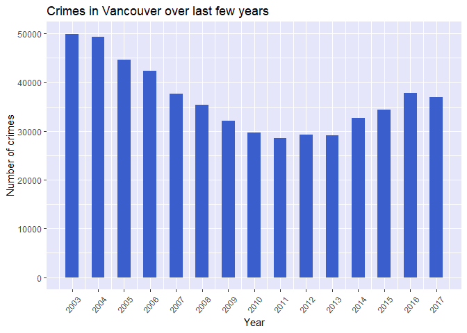<!-- -->

The crime numbers show a dowwnward trent till 2012-2013. However, after 2013 there is upward trend.


#### **Crime Categories**


The following plot shows crimes in all years based on crime types.


```r
   bar_chart_types <- ggplot(crime_data, aes(TYPE))+
     geom_bar(fill = "royalblue3")+ 
     labs(x="Crime Type", y="Number of crimes", title = "Crime categories")+
     theme(axis.text.x = element_text(angle = 90,vjust = 0.5), panel.background = element_rect(fill = "lavender"))
     
bar_chart_types
```

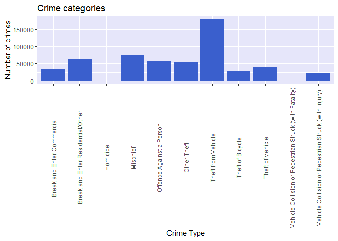<!-- -->

Clearly **Theft from Vehicle** accounts to the maximum number of crimes reported by a big margin in last 15 years. While Crimes for categories **Homicide** and **Vehicle Collision or Pedestrian Struck (with Fatality)** accounts for the minimum numbers. 

Also categories "Vehicle Collision or Pedestrian Struck (with Fatality)" and "Vehicle Collision or Pedestrian Struck (with Injury)" have small number and are closely related. So clubbing them into one single category**(Veh. collision/Pedestrian struck(Injury & Fatality))** for better analysis. 


Lastly, clubbing togethe "Theft of Vehicle" and "Theft of Bicycle" into a single crime category **Theft of Vechicle/Bicycle** Following is the R code which does that. 


```r
   crime_data$TYPE<- as.character(crime_data$TYPE)
 
   crime_data$TYPE<-sapply(crime_data$TYPE, function(x){ifelse(x =="Vehicle Collision or Pedestrian Struck (with Fatality)"|x=="Vehicle Collision or Pedestrian Struck (with Injury)",
                                            "Veh. collision/Pedestrian struck(Injury & Fatality)",x )})
    
   
   crime_data$TYPE<-sapply(crime_data$TYPE, function(x){ifelse(x =="Theft of Vehicle"|x=="Theft of Bicycle",
                                                               "Theft of Vechicle/Bicycle",x )})
   crime_data$TYPE <-as.factor(crime_data$TYPE)
```


Plotting crime by categories again with modified labels. 


```r
   bar_chart_types <- ggplot(crime_data, aes(TYPE))+
     geom_bar(fill = "royalblue3")+ 
     labs(x="Crime Type", y="Number of crimes", title = "Vancouver Crime numbers by Crime Types")+
     theme(axis.text.x = element_text(angle = 90,vjust = 0.5), panel.background = element_rect(fill = "lavender"))
   
   bar_chart_types
```

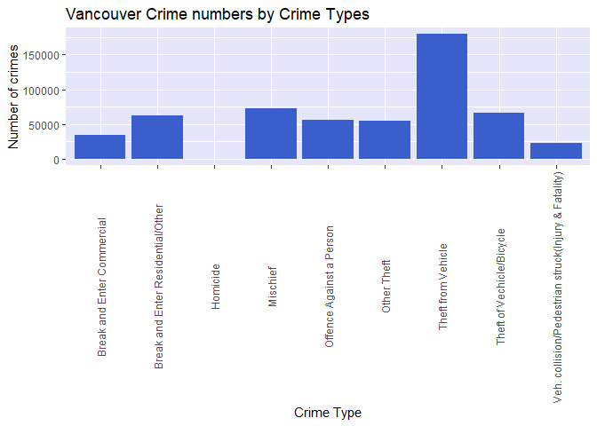<!-- -->
#### **Vancouver Crime by location**


Following code provides information about the crime based on neighbourhood location in city of Vancouver


```r
bar_chart_loc <- ggplot(crime_data, aes(NEIGHBOURHOOD))+
     geom_bar(fill = "royalblue3")+ 
     labs(x="Region", y="Number of crimes", title = "Vancouver Crime numbers by Region")+
     theme(axis.text.x = element_text(angle = 90,vjust = 0.5), panel.background = element_rect(fill = "lavender"))
   
   bar_chart_loc
```

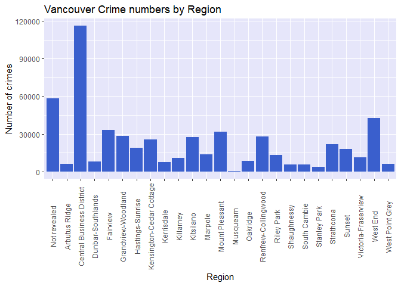<!-- -->

Clearly the crime numbers indicate that maximum number of crimes are reported from **Central Business District**  while the minmum numbers came from **Musqueam**. This could be due to how densely populated is Downtown(Central Business District) area and other factors for which city of Vancouver's census information is required. 

### Digging deeper into Crime data

So far we have checked crime numbers for different years, locations and types. It is quite imperative to see how all these numbers work together. 

#### Yearly Crime numbers by category and location

Following plot shows detailed information about yearly(2010-2017) crime numbers for each category and for different locations. 


```r
plot_all <- ggplot(crime_data %>% filter(YEAR>2009), aes(NEIGHBOURHOOD, fill = TYPE))+
     geom_bar()+ 
     labs(x="Region", y="Number of crimes", title = "Vancouver yearly crime numbers")+
     theme(axis.text.x = element_text(angle = 90,vjust = 0.5), 
           panel.background = element_rect(fill = "lavender"),
           legend.text = element_text(size = 7), legend.title = element_blank(), legend.position = "bottom")+
     facet_wrap(~YEAR, ncol =2)


ggsave("plot_all.png", width =16, height = 9)

plot_all
```

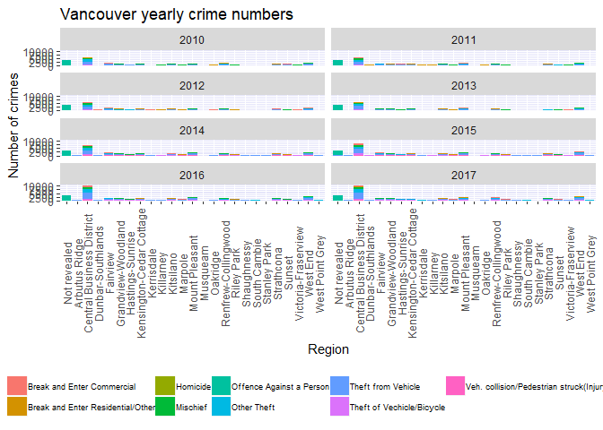<!-- -->


 The plot shows quite useful information. 
 * Yearly crime numbers and trend is similar for each category and location
 * The plot clearly shows that neighbourhood information for crimes against a person is kept private and not revealed by city of Vancouver. 
 * The trend  of crimes overall for all years and for each individual year is similar too. For instance, maximum crime numbers for 2010-17 comes from Central Business District while minimum comes from Stanley park and Musqueam which is true  overall for all years as well. 
  


Checking crime numbers overall for all years for each crime type and location. 


```r
plot_all2 <- ggplot(crime_data, aes(NEIGHBOURHOOD, fill = TYPE))+
     geom_bar()+ 
     labs(x="Region", y="Number of crimes", title = "Vancouver yearly crime numbers")+
     theme(axis.text.x = element_text(angle = 90,vjust = 0.5), 
           panel.background = element_rect(fill = "lavender"),
           legend.text = element_text(size = 7), legend.title = element_blank(), legend.position = "bottom")

plot_all2
```

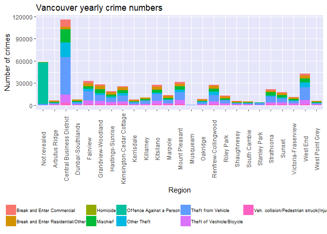<!-- -->


The plot clearly indicates that overall trend for all years is quite similar to individual years' crime distribution for locations and crime types. 


#### Crime numbers and timestamp


It will be interesting to see which month of a year, day of the week and hour of the day crimes were reported. Following section discusses relationship of crime numbers with timestamp. 


Following R code provides **crime statistics on monthly basis** for last 15 years


```r
bar_chart_monthly_all_years <- ggplot(filter(crime_data, !is.na(TIMESTAMP) ), aes(month(TIMESTAMP, label=TRUE), fill = TYPE))+
  geom_bar()+ 
  labs(x="Month", y="Number of crimes", title = "Monthly Crime numbers for all years")+
  theme(axis.text.x = element_text(angle = 90,vjust = 0.5),
        panel.background = element_rect(fill = "lavender"),
        legend.position = "bottom")

bar_chart_monthly_all_years
```

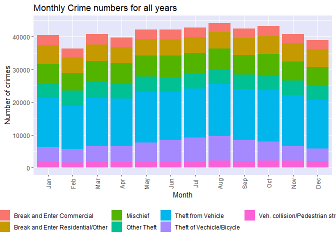<!-- -->


Let check if trend is similar is similar for last 4 years.


```r
## for individual years to see if trend is similar
bar_chart_monthly_last4_years <- ggplot(filter(crime_data, !is.na(TIMESTAMP), YEAR>2013 ), aes(month(TIMESTAMP, label=TRUE), fill = TYPE))+
  geom_bar()+ 
  labs(x="Month", y="Number of crimes", title = "Monthly Crime numbers last 4 years")+
  theme(axis.text.x = element_text(angle = 90,vjust = 0.5),
        panel.background = element_rect(fill = "lavender"),
        legend.position = "bottom")+
  facet_wrap(~YEAR,ncol=2)

bar_chart_monthly_last4_years
```

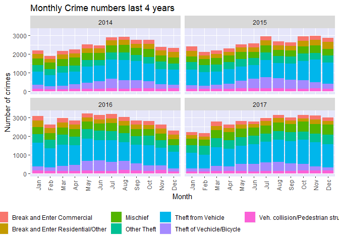<!-- -->

Clearly the numbers are similar for each year. Intersting observation is Winter months(especially **February**) has **lowest** number of crimes reported while **fall months** have compartvely **more** crimes reported.


Now checking **crime statistics for day of a weeek** for all years. 


```r
##day wise crime data all years

bar_chart_daily_all_years <- ggplot(filter(crime_data, !is.na(TIMESTAMP) ), aes(wday(TIMESTAMP, label=TRUE), fill = TYPE))+
  geom_bar()+ 
  labs(x="Day", y="Number of crimes", title = "Daily Crime numbers for all years")+
  theme(axis.text.x = element_text(angle = 90,vjust = 0.5),
        panel.background = element_rect(fill = "lavender"),
        legend.position = "bottom")

bar_chart_daily_all_years
```

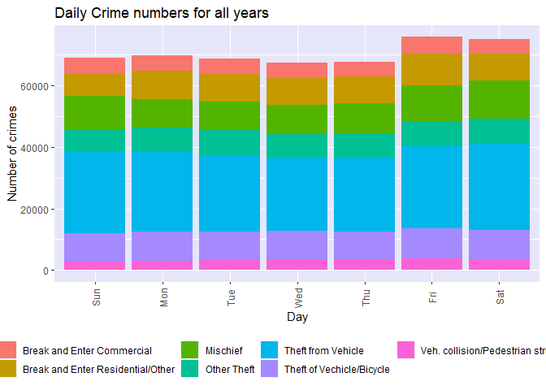<!-- -->


Comparing the trend with last 4 years. 


```r
bar_chart_daily_last4_years <- ggplot(filter(crime_data, !is.na(TIMESTAMP), YEAR>2013 ), aes(wday(TIMESTAMP, label=TRUE), fill = TYPE))+
  geom_bar()+ 
  labs(x="Day", y="Number of crimes", title = "Daily Crime numbers last 4 years")+
  theme(axis.text.x = element_text(angle = 90,vjust = 0.5),
        panel.background = element_rect(fill = "lavender"),
        legend.position = "bottom")+
  facet_wrap(~YEAR,ncol=2)

bar_chart_daily_last4_years
```

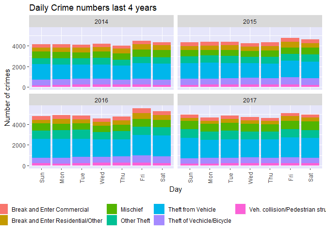<!-- -->

The day wise overall trends for all years and for last 4 years is similar.
* The maximum number of crimes are reported for weekends(maximum on Fridays)
* The minimum number of crimes are reported for Wednesdays and Thursdays. 
* Another interesting observation is the crime numbers are more for purple and blue regions over weekends which is theft of and theft from vehicles. 


Now lets check **crime numbers for particular hour of the day**


```r
## hour of the day crimes
bar_chart_hourly_all_years <- ggplot(filter(crime_data, !is.na(TIMESTAMP) ), aes(hour(TIMESTAMP), fill = TYPE))+
  geom_bar()+ 
  labs(x="Hour of the day", y="Number of crimes", title = "Hourly Crime numbers for all years")+
  theme(axis.text.x = element_text(angle = 90,vjust = 0.5),
        panel.background = element_rect(fill = "lavender"),
        legend.position = "bottom")+
  scale_x_continuous(breaks = unique(hour(crime_data$TIMESTAMP)))

bar_chart_hourly_all_years
```

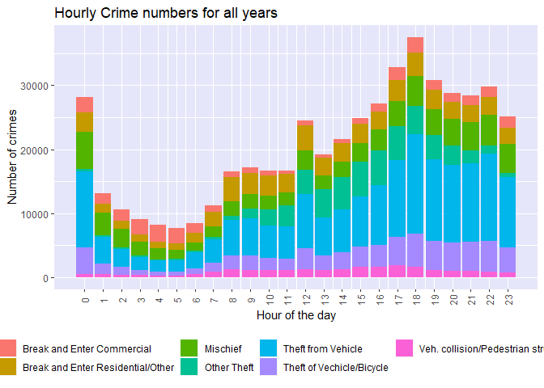<!-- -->

Comparing times for last 4 years


```r
bar_chart_hourly_last4_years <- ggplot(filter(crime_data, !is.na(TIMESTAMP), YEAR>2013 ), aes(hour(TIMESTAMP), fill = TYPE))+
  geom_bar()+ 
  labs(x="Hour of the day", y="Number of crimes", title = "Daily Crime numbers last 4 years")+
  theme(axis.text.x = element_text(angle = 90,vjust = 0.5),
        panel.background = element_rect(fill = "lavender"),
        legend.position = "bottom")+
  facet_wrap(~YEAR,ncol=2)


bar_chart_hourly_last4_years
```

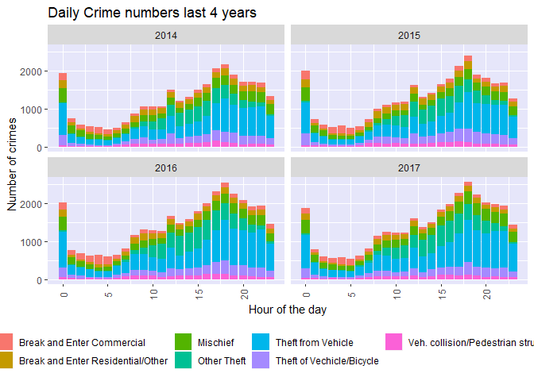<!-- -->


Hourly overall trends for all years is also similar ot the overall trends for individual years. 
* Maximum number of crimes are reported for late evening(around 18:00 hours)
* Early morning hours 02:00- 05:00 have less number of crimes reported 


### Interactive maps for last two years Theft of Vehicles


As there are 549833 observations for last 15 years crime data, It will not be practically feasible to analyze locations of all crime points on map.So using mapview package to **plot Theft of vehicle and Theft from Vehicle for last two years** to see the location of crime reported based on latitude and longitude values calculated earlier. 


```r
## loading shape file for last two years
  
  yvr_shp1 <- readOGR(".", "crime_shp_2016")
```

```
## OGR data source with driver: ESRI Shapefile 
## Source: "C:\Users\I853328\OneDrive - SAP SE\Data science\Github Projects\vancouverCrimeDataExploration", layer: "crime_shp_2016"
## with 34634 features
## It has 8 fields
```

```r
  yvr_shp2 <- readOGR(".", "crime_shp_2017")
```

```
## OGR data source with driver: ESRI Shapefile 
## Source: "C:\Users\I853328\OneDrive - SAP SE\Data science\Github Projects\vancouverCrimeDataExploration", layer: "crime_shp_2017"
## with 33745 features
## It has 8 fields
```

```r
## combining two shape files
yvr_shp<-  rbind(yvr_shp1,yvr_shp2)

##converting into data frame to perform filtering operations
yvr_shp_df <- as.data.frame(yvr_shp)

## filtering for theft of and theft from vechicle data for last two years
yvr_shp_df_2016 <-  yvr_shp_df %>% filter( (TYPE =="Theft from Vehicle"| TYPE == "Theft of Bicycle"| TYPE =="Theft of Vehicle"),YEAR ==2016)
   
yvr_shp_df_2017 <-  yvr_shp_df %>% filter( (TYPE =="Theft from Vehicle"| TYPE == "Theft of Bicycle"| TYPE =="Theft of Vehicle"), YEAR ==2017)

## Converting back to Spatial points data frame to plot on map
yvr_theft_vech_2016 <- SpatialPointsDataFrame(coords = yvr_shp_df_2016[,c(9,10)], data = yvr_shp_df_2016, proj4string = CRS("+proj=utm +zone=10 +datum=NAD83 +units=m +no_defs +ellps=GRS80
+towgs84=0,0,0"))


yvr_theft_vech_2017 <- SpatialPointsDataFrame(coords = yvr_shp_df_2017[,c(9,10)], data = yvr_shp_df_2017, proj4string = CRS("+proj=utm +zone=10 +datum=NAD83 +units=m +no_defs +ellps=GRS80
+towgs84=0,0,0"))


map2016 <- mapview(yvr_theft_vech_2016, zcol = c("TYPE","N_HOOD"), legend =TRUE)
map2017<-mapview(yvr_theft_vech_2017, zcol = c("TYPE","N_HOOD"), legend =TRUE)

##map2016
##map2017
```


### Conclusion and future scope

The data set analysis and visualization gives fair bit of insight on crimes in city of Vancouver. 

The data set clearly indicate certain patterns of crime numbers when it comes to 
* Location (locations like Dowtomwn have more crimes reported)
* Type of Crime(Theft of Vehicle and Theft from Vehicle accounr for max)
* Time of the day
* Time in year
* Day of the week


This can definitely be helpful for City of Vancouver's police department to come up with plans to control and prevent crime based on location, type and timestamps of crime. 

Also, the data set can be clubbed with demographic and census information of the City to come up with features/variables which can be modeled to predict crime info. 


### Disclaimer
The release of Vancouver Police Department (VPD) crime data is intended to enhance community awareness of policing activity in Vancouver. Users are cautioned not to rely on the information provided to make decisions about the specific safety level of a specific location or area. By using this data the user agrees and understands that neither the Vancouver Police Department, Vancouver Police Board nor the City of Vancouver assumes liability for any decisions made or actions taken or not taken by the user in reliance upon any information or data provided. 

While every effort has been made to be transparent in this process, users should be aware that this data is designed to provide individuals with a general overview of incidents falling into several crime categories. The information provided therefore does not reflect the total number of calls or complaints made to the VPD. Please refer to the FAQ (http://geodash.vpd.ca/docs/VPD%20GeoDASH%20FAQs.pdf) for further details. The data provided is based upon information contained in the VPD Records Management System. The crime classification and file status may change at any time based on the dynamic nature of police investigations. The VPD has taken great care to protect the privacy of all parties involved in the incidents reported. No personal or identifying information has been provided in the data. Locations for reported incidents involving Offences Against a Person have been deliberately randomized to several blocks and offset to an intersection. No time or street location name will be provided for these offences. For property related offences, the VPD has provided the location to the hundred block of these incidents within the general area of the block. All data must be considered offset and users should not interpret any locations as related to a specific person or specific property.


